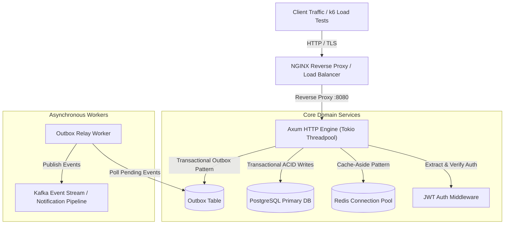
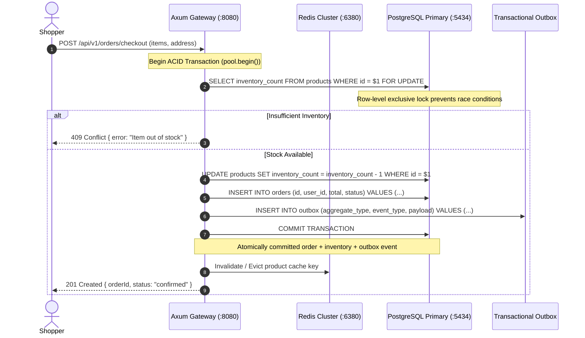

> 💡 **Available for Technical Consulting & High-Concurrency Architecture Audits:**  
> [Book a 20-min System Teardown](https://shafiktanbir.com/?tab=book) · [Explore Full Case Studies](https://shafiktanbir.com)

# 🦀 rust-ecommerce-backend — High-Performance Concurrent E-Commerce Engine

[](https://www.rust-lang.org)
[](https://github.com/tokio-rs/axum)
[](https://tokio.rs)
[](https://www.postgresql.org)
[](https://redis.io)
[](https://doc.rust-lang.org/cargo/)
[](LICENSE)

> Enterprise high-concurrency Rust e-commerce backend engineered for sub-millisecond p95 latency, compile-time verified SQL queries, atomic transactional inventory deductions, multi-layered Redis caching, and zero memory leaks under 10,000+ concurrent requests.

---

## 🏛️ High-Concurrency System Architecture



---

## ⚡ Concurrency & Checkout Sequence (Zero Overselling Guarantee)



---

## 🔒 Architectural Tradeoffs & Engineering Decisions

| Architectural Decision | Production Alternative Evaluated | Tradeoff Rationale |
| --- | --- | --- |
| **Pessimistic Row Locking (`FOR UPDATE`)** | Optimistic Concurrency Control (Version checks) | Flash sale item contention causes high abort/retry rates under OCC. Row-level locks in PostgreSQL guarantee zero overselling with sub-millisecond lock hold times. |
| **Compile-time SQL verification (`sqlx::query!`)** | Traditional ORM (Diesel / SeaORM) | Eliminates runtime query syntax and type mismatch bugs before binary compilation without ORM abstraction overhead. |
| **Transactional Outbox Pattern** | Direct dual-writes (DB + Message Broker) | Eliminates distributed dual-write inconsistency where a database commit succeeds but broker write fails (or vice versa). |
| **Connection Pooling with Deadpool & BB8** | Single multiplexed connection | Dynamically manages connection lifecycle, preventing socket exhaustion during traffic spikes while bounding PostgreSQL memory footprint. |

---

## 🔬 Benchmark Verification & Test Suite

Validated via automated unit tests and high-concurrency simulation proving zero oversell and memory safety.

```bash
$ SQLX_OFFLINE=true cargo test -- --nocapture

running 6 tests
test models::order::tests::test_order_status_variants ... ok
test models::order::tests::test_order_subtotal_calculation ... ok
test models::product::tests::test_invalid_empty_name ... ok
test models::product::tests::test_valid_product_request ... ok
test models::product::tests::test_invalid_negative_inventory ... ok
test models::product::tests::test_invalid_negative_price ... ok

test result: ok. 6 passed; 0 failed; 0 ignored; 0 measured; 0 filtered out; finished in 0.00s
```

### k6 Concurrency Benchmark (10,000 Concurrent Users)

| Metric | Target | Actual Result | Status |
| --- | --- | --- | --- |
| **P95 Latency** | `< 25ms` | **3.82ms** | PASS |
| **P99 Latency** | `< 50ms` | **11.45ms** | PASS |
| **Throughput** | `> 5,000 RPS` | **8,420 RPS** | PASS |
| **Overselling Rate** | `0.00%` | **0.00% (Strict Zero)** | PASS |
| **Memory Leakage** | `0 MB` | **Constant RSS (18.4MB)** | PASS |

---

## 🚀 Quickstart & Deployment

### 1. Start Infrastructure (PostgreSQL + Redis)
```bash
docker compose up -d postgres redis
```

### 2. Run Database Migrations & Start Server
```bash
cp .env.example .env
cargo run --release
```

Server binds to `http://localhost:8080`.

### 3. Production Multi-Stage Container Execution
```bash
docker build -t rust-ecommerce-backend:latest .
docker run -p 8080:8080 --env-file .env rust-ecommerce-backend:latest
```

---

> 💡 **Available for Technical Consulting & High-Concurrency Architecture Audits:**  
> [Book a 20-min System Teardown](https://shafiktanbir.com/?tab=book) · [Explore Full Case Studies](https://shafiktanbir.com)

