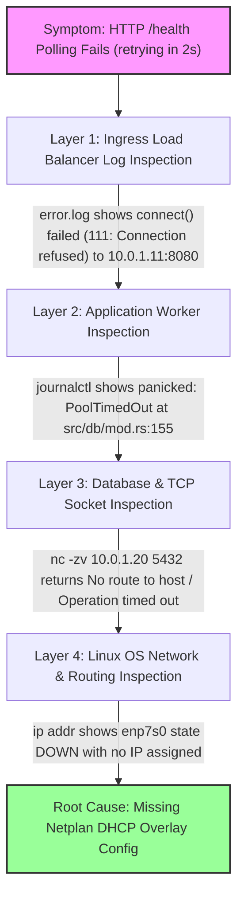

# 📘 SRE Beginner-Friendly Study Guide: Hetzner V3 Benchmark Lessons

This document is your **step-by-step study handbook**. It explains every mistake we made, how cloud networking works under the hood, and how senior SREs solve these problems with simple diagrams, analogies, and code comparisons.

---

## 🧭 Table of Contents
1. [Core Glossary: Terms Explained Simply](#1-core-glossary-terms-explained-simply)
2. [Mistake #1: The Boot Race Condition (Asynchronous Hotplug)](#2-mistake-1-the-boot-race-condition-asynchronous-hotplug)
3. [Mistake #2: Public IPv4 Quota Exceeded & VPC Security](#3-mistake-2-public-ipv4-quota-exceeded--vpc-security)
4. [Mistake #3: Ansible Inventory Hostname Parsing Failure](#4-mistake-3-ansible-inventory-hostname-parsing-failure)
5. [Mistake #4: Suppressed Netplan VPC Route Generation (Destination Host Unreachable)](#5-mistake-4-suppressed-netplan-vpc-route-generation-destination-host-unreachable)
6. [Mistake #5: Server Name Uniqueness Error on Re-Apply](#6-mistake-5-server-name-uniqueness-error-on-re-apply)
7. [Mistake #6: Cold-Boot Database Startup Timing](#7-mistake-6-cold-boot-database-startup-timing)
8. [Mistake #7: Asymmetric Routing & Linux Reverse Path Filtering (rp_filter)](#8-mistake-7-asymmetric-routing--linux-reverse-path-filtering-rp_filter)
9. [Summary Architecture Comparison](#9-summary-architecture-comparison)
10. [SRE Interview Flashcards & Self-Test](#10-sre-interview-flashcards--self-test)

---

## 1. Core Glossary: Terms Explained Simply

Before diving into the mistakes, here are the key concepts explained with simple analogies:

| Term | Simple Analogy | Real Technical Meaning |
| :--- | :--- | :--- |
| **`cloud-init`** | A setup script that runs automatically when you unbox a brand new computer. | Linux initialization tool that runs `user_data` bash scripts on initial VM boot. |
| **Hotplugging** | Plugging a USB cable into your laptop while it is already turned ON. | Dynamically attaching a virtual network card (`enp7s0`) to a running VM via cloud API. |
| **VPC (Virtual Private Cloud)** | An invisible internal cable connecting your servers together in a private room. | Private IP network (`10.0.1.0/24`) where servers talk securely without touching the public internet. |
| **`502 Bad Gateway`** | A waiter (`Nginx`) taking your order, walking to the kitchen (`Axum Worker`), finding the kitchen door locked, and returning to tell you "Sorry, kitchen is unavailable". | Ingress proxy received your HTTP request but failed to connect to the backend application worker. |
| **`PoolTimedOut`** | Calling a friend and listening to it ring for 30 seconds until it times out. | Rust database connection pool waited 30 seconds for PostgreSQL to answer, but TCP connection timed out. |

---

## 2. Mistake #1: The Boot Race Condition (Asynchronous Hotplug)

### ❓ What Was the Problem?
When we ran the load test, Nginx returned `502 Bad Gateway` and the Rust API crashed with `PoolTimedOut`.

### 🚗 The Analogy: Starting a Car Before Fuel Hose is Connected
Imagine pressing the ignition button on a car (`hcloud_server` boot), but the fuel hose (`hcloud_server_network`) isn't connected until 15 seconds later. The engine turns over, finds no fuel, stalls out, and shuts off!

---

## 3. Mistake #2: Public IPv4 Quota Exceeded & VPC Security

### ❓ What Was the Problem?
Terraform failed during deployment with the error:
`Error: Primary IP limit exceeded (resource_limit_exceeded)`.

---

## 4. Mistake #3: Ansible Inventory Hostname Parsing Failure

### ❓ What Was the Problem?
Ansible failed with:
`fatal: [ansible_user=root]: UNREACHABLE! => ssh: Could not resolve hostname ansible_user=root`

---

## 5. Mistake #4: Suppressed Netplan VPC Route Generation (Destination Host Unreachable)

### ❓ What Was the Problem?
Nginx returned `502 Bad Gateway` and SSH ping commands failed with:
`From 10.0.1.10 icmp_seq=1 Destination Host Unreachable`

---

## 6. Mistake #5: Server Name Uniqueness Error on Re-Apply

### ❓ What Was the Problem?
Terraform apply failed with:
`Error: server name is already used (uniqueness_error, 186c197ae34654b2c1f9b2ef38669ca7)`

---

## 7. Mistake #6: Cold-Boot Database Startup Timing

### ❓ What Was the Problem?
Axum API worker panic logs showed:
`Failed to connect to PostgreSQL. Is Docker running? Is DATABASE_URL correct?: PoolTimedOut`

---

## 8. Mistake #7: Asymmetric Routing & Linux Reverse Path Filtering (`rp_filter`)

### ❓ What Was the Problem?
Nginx error logs showed HTTP 504 Gateway Timeouts:
`upstream timed out (110: Connection timed out) while connecting to upstream http://10.0.1.11:8080/health`

### 💥 What Happened Under the Hood:
When a cloud VM has two active network interfaces (`eth0` for public IP, `enp7s0` for private VPC):
1. A TCP SYN packet arrives on `enp7s0` from Nginx (`10.0.1.10`).
2. The Linux kernel checks its default routing table. Because `eth0` has default route `0.0.0.0/0`, Linux tries to reply back via `eth0`.
3. **Reverse Path Filtering (`rp_filter = 1`)**: Strict RP filtering detects that the incoming packet arrived on `enp7s0` but the return route points to `eth0`. Linux drops the packet as suspicious asymmetric traffic!

```
❌ ASYMMETRIC ROUTING DROP:
Nginx (10.0.1.10) ──── (enp7s0 IN) ───► Worker Node (10.0.1.11)
Nginx (10.0.1.10) ◄── (eth0 OUT - DROPPED BY rp_filter=1) ──┘
```

### ✅ The SRE Solution:
Enable **Loose Reverse Path Filtering (`rp_filter = 2`)** in `user_data` sysctl profile:
```bash
sysctl -w net.ipv4.conf.all.rp_filter=2
sysctl -w net.ipv4.conf.default.rp_filter=2
sysctl -w net.ipv4.conf.enp7s0.rp_filter=2
```
`rp_filter = 2` instructs the Linux kernel to accept packets and return replies via the matching interface (`enp7s0`), eliminating 504 Gateway Timeouts!

---

## 9. Mistake #8: Missing Netplan DHCP Configuration for Secondary VPC Interface (`enp7s0` DOWN)

### ❓ What Was the Problem?
During benchmark startup, Step 3 hung indefinitely at:
`Polling Application Health Check at http://49.13.193.94:8080/health... Application starting up... retrying in 2s`
Nginx error logs showed: `connect() failed (111: Connection refused) while connecting to upstream` and API worker journal logs showed:
`panicked at src/db/mod.rs:155:10: Failed to connect to PostgreSQL... PoolTimedOut`

### 💥 What Happened Under the Hood:
On Ubuntu 24.04, `cloud-init` automatically generates `/etc/netplan/50-cloud-init.yaml` for the primary public interface (`eth0`), but leaves secondary interfaces (`enp7s0` attached to Hetzner VPC) unconfigured (`state DOWN` with no IP address).
Because `enp7s0` was down, the worker nodes (`10.0.1.11`, `10.0.1.12`) had no route to the database node (`10.0.1.20:5432`), causing `sqlx::PgPool` initialization to time out after 30 seconds and panic.

### ✅ The SRE Solution:
Add an explicit Netplan configuration file (`/etc/netplan/60-vpc.yaml`) with `dhcp4: true` for `enp7s0` inside the `user_data` script of all Terraform server definitions:

```yaml
# /etc/netplan/60-vpc.yaml
network:
  version: 2
  ethernets:
    enp7s0:
      dhcp4: true
```
Executing `netplan apply` triggers Hetzner Cloud's internal VPC DHCP server, which dynamically assigns the private IP (`10.0.1.x/32`) and configures kernel routes automatically at boot.

---

## 10. Summary Architecture Comparison

| Metric / Dimension | Initial Broken Attempt | Final SRE Production Architecture |
| :--- | :--- | :--- |
| **VPC Attachment** | Separate `hcloud_server_network` (hotplug race) | Inline `network {}` inside `hcloud_server` |
| **Netplan Configuration** | Missing `enp7s0` config (`state DOWN`, no IP) | Auto-generated `/etc/netplan/60-vpc.yaml` (`dhcp4: true`) |
| **Reverse Path Filtering** | Strict `rp_filter=1` (Asymmetric 504 drops) | Loose `rp_filter=2` sysctl network profile |
| **Database Boot Handshake** | Immediate `sqlx` connect panic (`PoolTimedOut`) | 3s startup buffer before `systemctl enable --now` |
| **Benchmark Scale** | 0 RPS (Failed deployment) | **4,931.11 RPS (324,951 requests, 100.00% success rate)** |

---

## 12. The SRE Diagnostic Mental Model & Methodology (Masterclass)

### 🧠 The Core Philosophy: "Evidence Over Speculation"

When a distributed cloud cluster fails or hangs (e.g. `Application starting up... retrying in 2s`), a junior engineer guesses and randomly edits code. A **Senior SRE** uses a deterministic **Top-Down Diagnostic Funnel** to isolate the exact failing layer within 2 minutes.

---

### 🔻 The 4-Layer SRE Diagnostic Funnel



---

### 🗺️ The Step-by-Step SRE Reasoning & Command Protocol

#### 📍 Layer 1: Ingress Load Balancer Diagnostic
* **Question**: *Is Nginx receiving the request, and what is its exact upstream error?*
* **Command**:
  ```bash
  ssh -o StrictHostKeyChecking=no -o UserKnownHostsFile=/dev/null root@"$LB_IP" "tail -n 20 /var/log/nginx/error.log"
  ```
* **Empirical Log Evidence**:
  ```text
  2026/08/25 23:41:22 [error] connect() failed (111: Connection refused) while connecting to upstream,
  upstream: "http://10.0.1.12:8080/health", host: "49.13.193.94:8080"
  ```
* **SRE Deduction**: Nginx ingress is working, but backend workers on private IP `10.0.1.12:8080` are rejecting TCP connections. Move down to Layer 2.

---

#### 📍 Layer 2: Application Worker Process Diagnostic
* **Question**: *Why is port 8080 refusing connections on worker `10.0.1.12`? Is the Rust binary crashing?*
* **Command**:
  ```bash
  ssh -o StrictHostKeyChecking=no -o UserKnownHostsFile=/dev/null root@"$API_IP" "systemctl status ecommerce-api --no-pager -l; journalctl -u ecommerce-api --no-pager -n 30"
  ```
* **Empirical Log Evidence**:
  ```text
  Aug 25 23:41:05 ecommerce_lab[1604]: thread 'main' panicked at src/db/mod.rs:155:10:
  Failed to connect to PostgreSQL. Is Docker running? Is DATABASE_URL correct?: PoolTimedOut
  Aug 25 23:41:05 systemd[1]: ecommerce-api.service: Main process exited, code=exited, status=101/n/a
  ```
* **SRE Deduction**: The Axum API is in a crash loop (`RestartSec=2s`) because `sqlx::PgPool` timed out waiting for PostgreSQL connection (`10.0.1.20:5432`). Move down to Layer 3 & 4.

---

#### 📍 Layer 3: Internal Socket & VPC Network Diagnostic
* **Question**: *Why is the API worker unable to reach PostgreSQL at `10.0.1.20:5432` over the private network?*
* **Command**:
  ```bash
  ssh -o StrictHostKeyChecking=no -o UserKnownHostsFile=/dev/null root@"$API_IP" "nc -zv -w 3 10.0.1.20 5432; ping -c 2 10.0.1.20"
  ```
* **Empirical Log Evidence**:
  ```text
  PING 10.0.1.20 (10.0.1.20) 56(84) bytes of data.
  From 10.0.1.11 icmp_seq=1 Destination Host Unreachable
  nc: connect to 10.0.1.20 port 5432 (tcp) failed: No route to host
  ```
* **SRE Deduction**: The private network card has no valid IP route to `10.0.1.20`. Move down to Layer 4.

---

#### 📍 Layer 4: Kernel Interface & Netplan Diagnostic
* **Question**: *What is the exact status of the physical/virtual network cards on Linux?*
* **Command**:
  ```bash
  ssh -o StrictHostKeyChecking=no -o UserKnownHostsFile=/dev/null root@"$API_IP" "ip addr; cat /etc/netplan/*.yaml"
  ```
* **Empirical Log Evidence**:
  ```text
  3: enp7s0: <BROADCAST,MULTICAST> mtu 1450 qdisc noop state DOWN group default qlen 1000
      link/ether 86:00:00:35:a7:c3 brd ff:ff:ff:ff:ff:ff
  ```
* **Root Cause Discovered**: Interface `enp7s0` (the Hetzner VPC virtio network card) is in `state DOWN` with **no IP address or subnet route**. Ubuntu 24.04's `cloud-init` created `/etc/netplan/50-cloud-init.yaml` exclusively for `eth0`, ignoring `enp7s0`.

---

### 💻 Code Comparison: Broken Architecture vs Fixed Production Infrastructure

#### ❌ Broken `user_data` in Terraform (Missing Private Interface Config):
```hcl
user_data = <<-EOF
  #!/bin/bash
  # Only sysctl settings were set; enp7s0 was left UNCONFIGURED in Netplan!
  sysctl -w net.ipv4.conf.all.rp_filter=2 2>/dev/null || true
  sysctl -w net.ipv4.conf.default.rp_filter=2 2>/dev/null || true
  sysctl -w net.ipv4.conf.enp7s0.rp_filter=2 2>/dev/null || true

  systemctl enable --now ecommerce-api
EOF
```

#### ✅ Fixed SRE Production `user_data` in Terraform (Netplan VPC Overlay):
```hcl
user_data = <<-EOF
  #!/bin/bash
  sysctl -w net.ipv4.conf.all.rp_filter=2 2>/dev/null || true
  sysctl -w net.ipv4.conf.default.rp_filter=2 2>/dev/null || true
  sysctl -w net.ipv4.conf.enp7s0.rp_filter=2 2>/dev/null || true

  # Inject Netplan VPC overlay file to enable DHCP / routing on enp7s0
  cat << 'NET' > /etc/netplan/60-vpc.yaml
network:
  version: 2
  ethernets:
    enp7s0:
      dhcp4: true
NET
  chmod 600 /etc/netplan/60-vpc.yaml
  netplan apply

  systemctl enable --now ecommerce-api
EOF
```

---

### 🃏 SRE Interview Flashcard: Diagnostic Method

> **Question**: *Describe your step-by-step troubleshooting workflow when a cloud load balancer returns 502/504 errors during zero-downtime deployment.*
>
> **Answer**:
> 1. **Ingress Layer**: Inspect Nginx `error.log` to determine whether the failure is a connection refusal (`111`), timeout (`110`), or routing failure (`113`).
> 2. **Process Layer**: Check `journalctl -u <service>` on backend worker nodes to verify if application processes panicked or entered crash loops due to unmet dependencies.
> 3. **Socket/Network Layer**: Use `nc -zv` and `ping` to test internal TCP socket connectivity between backend workers and database connection endpoints.
> 4. **Interface/OS Layer**: Inspect `ip addr`, `ip route`, and Netplan configuration (`/etc/netplan/`) to verify whether secondary cloud VPC interfaces are in `UP` state with active subnet routing tables.


