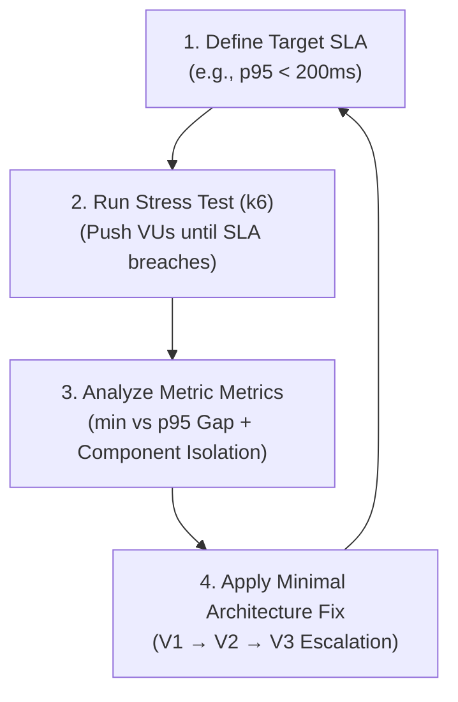

# 📖 Master Guide: Backend Performance Engineering & Diagnostics

> **Author**: Research Playground Loop — High-Throughput Systems Engineering  
> **Target Application**: Scalable Microservices, Monoliths, Rust/Go/Node Backends, Caches & Databases

---

## 🧠 1. The Core Mental Model: Evidence-Based Bottleneck Isolation

Never guess why a backend is slow. Follow the 4-step diagnostic loop:



---

## 📐 2. The Golden Rule of Latency Interpretation

$$\begin{aligned}
\text{Total User Latency} &= \text{Actual Work Execution Time} + \text{Queueing Waiting Time} \\
\mathbf{p95} &= \mathbf{min} + \mathbf{\text{Queueing Delay}}
\end{aligned}$$

### Diagnostic Decision Tree:

| Metric Signature | Root Cause | Action Required |
| :--- | :--- | :--- |
| **Low `min` (<1ms) + High `p95` (>200ms)** | **Queueing / Saturation Bottleneck**<br/>(Requests sitting in TCP backlog or pool queues) | Add Load Balancer (V3), increase connection pool, or scale workers. |
| **High `min` (>100ms) + High `p95` (>500ms)** | **Code / Query Bottleneck**<br/>(The code/query itself is slow even for 1 user) | Add DB indexes, optimize SQL queries, fix $O(N^2)$ loops, add caching. |
| **High `http_req_failed` (>1.0%)** | **Connection / Memory Collapse**<br/>(OS socket backlog `SOMAXCONN` overflow or OOM) | Check kernel parameters, handle socket timeouts, scale instance count. |

---

## 🔬 3. Component Isolation Testing (The 3-Step Verification Protocol)

When a load test breaches SLAs, **never assume which layer is failing**. Isolate and verify each layer:

```text
Full Stack Request Path:
[Client / k6] ──► [OS TCP Socket] ──► [HTTP Web Router] ──► [Pool Handles] ──► [Cache / Database Engine]
```

### Step-by-Step Isolation Protocol:

1. **Step 1: Test Full Stack (`k6`)**
   - Command: `k6 run load-tests/v2_choke_test.js`
   - Purpose: Measures end-to-end user latency including HTTP parsing, JSON serialization, routing, and DB calls.

2. **Step 2: Test Cache/Database Engine in Isolation**
   - Command (Redis): `docker exec ecommerce_lab_redis redis-benchmark -h 127.0.0.1 -p 6379 -n 50000 -q -t get`
   - Command (PostgreSQL): `pgbench -h localhost -p 5434 -U ecommerce -c 10 -t 1000 ecommerce_lab`
   - **Deduction Rule**: If Redis handles **48,000+ RPS** in isolation, but the Web API maxes out at **3,100 RPS**, the bottleneck is 100% inside the Web API / OS Socket layer, NOT Redis.

3. **Step 3: Inspect Internal Daemon Telemetry**
   - Command: `docker exec ecommerce_lab_redis redis-cli INFO commandstats`
   - Command: `docker exec ecommerce_lab_redis redis-cli SLOWLOG GET 10`
   - **Deduction Rule**: If query execution time is `1.18 µs` (microseconds), the database daemon is completely healthy.

---

## 🧮 4. Queueing Theory & Little's Law

$$\text{Active Waiting Requests } (L) = \text{Arrival Rate } (\lambda) \times \text{Average Latency } (W)$$

### Connection Pool Saturation Formula:
$$\text{Pool Saturation Ratio} = \frac{\text{Concurrent Active VUs}}{\text{Max Connection Pool Size}}$$

* **Example**: 1,000 VUs fighting for 100 Redis pool handles:
  - **100 VUs** actively communicate with Redis.
  - **900 VUs** are suspended in Tokio async memory waiting for handles.
  - Result: `min = 0.51ms`, but `p95 = 360ms` due to queueing line delay.

---

## 🪜 5. The System Architectural Escalation Ladder (V1 to V10)

```text
[V1 Monolith] ─────────► [V2 Cache-Aside] ─────────► [V3 Load Balancer] ─────────► [V4 Job Queue]
 DB Pool Bottleneck       Reads offloaded to RAM     Socket/Port Listener Bound    Async Offload
 (p95 > 574ms)            (min = 0.26ms)             (Scale Nginx + 3x Workers)   (Background Tasks)
```

| Milestone | Bottleneck | Architecture Fix | Expected Outcome |
| :--- | :--- | :--- | :--- |
| **V1 Monolith** | PostgreSQL connection pool saturation (10 connections max) | Monolith baseline | `p95 = 574ms` at 500 VUs |
| **V2 Cache-Aside** | DB read I/O saturation under heavy reads | Redis in-memory cache | `min = 0.26ms`, 100k+ requests handled |
| **V3 Multi-Instance** | Single OS TCP listener (`port 8080`) & pool bounds | Nginx Load Balancer + 3x API Instances | Splits 3,000 VUs across ports 8081, 8082, 8083 |
| **V4 Async Queue** | Synchronous heavy writes (orders/emails) | Redis/RabbitMQ background job queue | Offloads checkout latency to async background workers |
| **V5 Read Replicas** | DB write lock contention | Postgres Primary (Writes) + Replicas (Reads) | Distributes DB read traffic across database instances |

---

## 📋 Quick Diagnostic Cheat Sheet for Terminal

```bash
# 1. Run k6 Stress Test
k6 run load-tests/v2_choke_test.js

# 2. Benchmark Downstream Redis Directly
docker exec ecommerce_lab_redis redis-benchmark -h 127.0.0.1 -p 6379 -n 50000 -q -t get

# 3. Check Redis Slow Log & Telemetry
docker exec ecommerce_lab_redis redis-cli SLOWLOG GET 5
docker exec ecommerce_lab_redis redis-cli INFO commandstats

# 4. Check Active Server Health
curl -s http://localhost:8080/health
```
