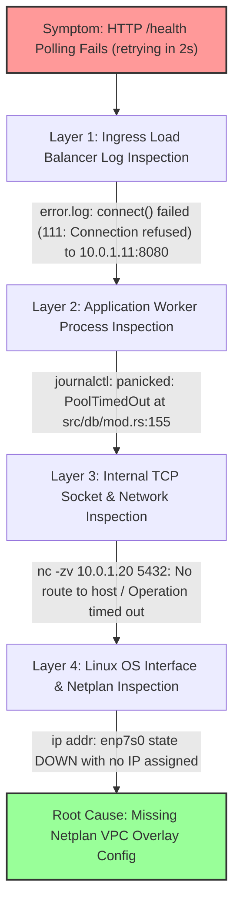

# 📖 SRE Scenario Study Guide: 502/504 Ingress Outage & The 4-Layer Diagnostic Funnel

This scenario guide is designed for **technical interview preparation** and **production SRE incident response**. It details the exact diagnostic steps, Linux kernel socket error codes, empirical command protocols, code diffs, and interview flashcards for isolating distributed cloud cluster failures.

---

## 🧭 Scenario Overview

| Dimension | Details |
| :--- | :--- |
| **Incident Symptom** | Automated deployment script hangs at `Polling Application Health Check at http://<LB_IP>:8080/health... Application starting up... retrying in 2s` |
| **User Impact** | Ingress load balancer returns `502 Bad Gateway` or `504 Gateway Timeout` |
| **System Architecture** | Multi-node Hetzner Cloud cluster (Nginx Ingress LB → Axum API Worker Nodes → PostgreSQL/Redis DB Node) |
| **Primary Skill** | Top-down evidence-driven incident investigation |

---

## 🔻 1. The 4-Layer Diagnostic Funnel

When an ingress health check fails, **never guess**. Trace the request top-down through the infrastructure hierarchy:



---

## ⚡ 2. Linux Kernel Socket Error Code Cheatsheet

Understanding the exact socket error codes returned in `/var/log/nginx/error.log` unlocks instant root cause diagnosis:

| Error Code | Kernel Error Message | Root Cause Meaning | SRE Action Required |
| :--- | :--- | :--- | :--- |
| **`111`** | `Connection refused` | Network route exists, but target IP/port has no process listening (binary crashed or service stopped). | Check `systemctl status` & `journalctl` on worker node. |
| **`110`** | `Connection timed out` | Packet reached interface, but return packet was dropped (e.g. firewall or strict `rp_filter=1` asymmetric drop). | Set `sysctl -w net.ipv4.conf.all.rp_filter=2`. |
| **`113`** | `No route to host` | OS routing table has no entry or target interface is `DOWN` with no IP assigned. | Inspect `ip addr`, `ip route`, and `/etc/netplan/`. |

---

## 🗺️ 3. Step-by-Step Diagnostic Protocol & Copy-Paste Commands

#### Step 1: Inspect Load Balancer Logs (Layer 1)
```bash
# Get Nginx LB IP from Terraform
cd infrastructure/v3-nginx-cluster/terraform
LB_IP=$(terraform output -raw nginx_lb_public_ip)

# Read Nginx upstream error logs
ssh -o StrictHostKeyChecking=no -o UserKnownHostsFile=/dev/null root@"$LB_IP" "tail -n 20 /var/log/nginx/error.log"
```
* **Log Output**: `connect() failed (111: Connection refused) while connecting to upstream http://10.0.1.11:8080/health`.
* **Deduction**: Nginx ingress is healthy, but worker process on `10.0.1.11:8080` is dead or not listening.

#### Step 2: Inspect Application Worker Service Logs (Layer 2)
```bash
API1_IP=$(terraform state show hcloud_server.api1 | grep ipv4_address | cut -d '=' -f2 | tr -d ' "')

# Read systemd status and panic logs
ssh -o StrictHostKeyChecking=no -o UserKnownHostsFile=/dev/null root@"$API1_IP" "systemctl status ecommerce-api --no-pager -l; journalctl -u ecommerce-api --no-pager -n 30"
```
* **Log Output**: `panicked at src/db/mod.rs:155:10: Failed to connect to PostgreSQL... PoolTimedOut`.
* **Deduction**: Axum is in a crash loop (`RestartSec=2s`) because `sqlx::PgPool` connection timed out waiting for PostgreSQL (`10.0.1.20:5432`).

#### Step 3: Probe Internal Network Sockets (Layer 3)
```bash
ssh -o StrictHostKeyChecking=no -o UserKnownHostsFile=/dev/null root@"$API1_IP" "nc -zv -w 3 10.0.1.20 5432; ping -c 2 10.0.1.20"
```
* **Log Output**: `nc: connect to 10.0.1.20 port 5432 (tcp) failed: No route to host` / `Destination Host Unreachable`.
* **Deduction**: API worker node has no active network route to `10.0.1.20`.

#### Step 4: Audit Linux Network Interfaces & Netplan (Layer 4)
```bash
ssh -o StrictHostKeyChecking=no -o UserKnownHostsFile=/dev/null root@"$API1_IP" "ip addr; cat /etc/netplan/*.yaml"
```
* **Log Output**: `3: enp7s0: <BROADCAST,MULTICAST> state DOWN` (No IP assigned). `/etc/netplan/50-cloud-init.yaml` only configured `eth0`.
* **Root Cause Discovered**: Hetzner VPC interface `enp7s0` was left unconfigured by `cloud-init`.

---

## 💻 4. Code Comparison: Broken Infrastructure vs Fixed SRE Code

#### ❌ Broken `user_data` (Missing Netplan Private Interface Config):
```hcl
user_data = <<-EOF
  #!/bin/bash
  sysctl -w net.ipv4.conf.all.rp_filter=2 2>/dev/null || true
  sysctl -w net.ipv4.conf.default.rp_filter=2 2>/dev/null || true
  sysctl -w net.ipv4.conf.enp7s0.rp_filter=2 2>/dev/null || true

  # enp7s0 was NOT configured in Netplan, leaving interface DOWN!
  systemctl enable --now ecommerce-api
EOF
```

#### ✅ Fixed Production SRE `user_data` (Netplan VPC Overlay):
```hcl
user_data = <<-EOF
  #!/bin/bash
  sysctl -w net.ipv4.conf.all.rp_filter=2 2>/dev/null || true
  sysctl -w net.ipv4.conf.default.rp_filter=2 2>/dev/null || true
  sysctl -w net.ipv4.conf.enp7s0.rp_filter=2 2>/dev/null || true

  # Inject Netplan overlay file to enable DHCP / routing on enp7s0
  cat << 'NET' > /etc/netplan/60-vpc.yaml
network:
  version: 2
  ethernets:
    enp7s0:
      dhcp4: true
NET
  chmod 600 /etc/netplan/60-vpc.yaml
  netplan apply

  systemctl enable --now ecommerce-api
EOF
```

---

## 🃏 5. SRE Technical Interview Flashcards

### 🃏 Flashcard 1: Diagnostic Methodology
> **Interview Question**: *Walk me through your diagnostic methodology when an ingress load balancer returns 502/504 errors during cloud infrastructure deployment.*
>
> **Senior Answer**:
> "I follow a 4-layer diagnostic funnel:
> 1. **Ingress Layer**: Inspect Nginx `error.log` to differentiate between socket refusal (`111`), timeout (`110`), or routing failure (`113`).
> 2. **Process Layer**: Check `journalctl -u <service>` on backend nodes to inspect process crash loops or connection pool timeouts (`PoolTimedOut`).
> 3. **Socket/Network Layer**: Use `nc -zv` and `ping` to test internal TCP socket reachability between worker subnets and DB endpoints.
> 4. **Kernel/OS Layer**: Inspect `ip addr`, `ip route`, and Netplan configuration (`/etc/netplan/`) to verify whether secondary cloud VPC interfaces are active with valid subnet routing tables."

### 🃏 Flashcard 2: Reverse Path Filtering
> **Interview Question**: *Why do dual-homed Linux VMs drop internal VPC traffic, and how do you fix it?*
>
> **Senior Answer**:
> "Under strict mode (`rp_filter = 1`), the Linux kernel drops incoming packets on secondary interfaces (`enp7s0`) if the return route points to the default gateway on `eth0`. The SRE fix is to configure loose Reverse Path Filtering (`net.ipv4.conf.all.rp_filter = 2`) in `sysctl`."

---

## 🧪 6. Real-World Edge Case Scenarios (Self-Study Drills)

To prepare for senior technical interviews, study these 3 common variations of this outage pattern:

### 📍 Case Study A: The Linux OOM Killer (Memory Exhaustion)
* **Symptom**: Nginx returns `502 Bad Gateway`. `systemctl status ecommerce-api` shows `code=killed, status=9/KILL`.
* **Diagnostic Trace**:
  ```bash
  dmesg -T | grep -i oom
  # Output: Out of memory: Killed process 1891 (ecommerce_lab) total-vm:2097152kB
  ```
* **Root Cause**: The application process exceeded server RAM limit during high load.
* **SRE Fix**: Add swap space, optimize database query buffer sizes, or scale server size (`cx23` → `cx33`).

---

### 📍 Case Study B: PostgreSQL Connection Exhaustion (`max_connections`)
* **Symptom**: k6 load test shows p95 latency spiking from 10ms → 30,000ms, then failing with 500 errors.
* **Diagnostic Trace**:
  ```bash
  ssh root@"$DB_IP" "docker exec -it ecommerce_lab_postgres psql -U ecommerce -d ecommerce_lab -c 'SELECT count(*) FROM pg_stat_activity;'"
  # Output: count = 100 (PostgreSQL max_connections limit reached!)
  ```
* **Root Cause**: Backend application pool size (`max_connections(10)`) multiplied across worker nodes exceeded PostgreSQL's global connection ceiling (`100`).
* **SRE Fix**: Increase PostgreSQL `max_connections` in `postgresql.conf` or introduce a connection pooler (e.g. `PgBouncer`).

---

### 📍 Case Study C: Netplan Permissions Security Warning
* **Symptom**: `netplan apply` outputs: `WARNING: Permissions for /etc/netplan/60-vpc.yaml are too open. Netplan configuration should NOT be accessible by others.`
* **Diagnostic Trace**: `ls -l /etc/netplan/60-vpc.yaml` shows `-rw-r--r--` (world-readable `644`).
* **Root Cause**: Netplan enforces strict file permissions (`600` or `0600`) to prevent unauthorized users from inspecting network topology or static credentials.
* **SRE Fix**: Always run `chmod 600 /etc/netplan/*.yaml` in deployment scripts.

---

## ⚡ 7. SRE Essential Terminal One-Liners Cheat Sheet

Keep these commands handy during live production debugging:

| Task | Command |
| :--- | :--- |
| **Check All Listening Sockets** | `ss -tulpn` |
| **Inspect Active Network Interfaces** | `ip addr` or `ip -br a` |
| **Inspect Linux Kernel Routing Table** | `ip route` |
| **Check Reverse Path Filter Settings** | `sysctl -a \| grep rp_filter` |
| **Tail Nginx Error Logs Live** | `tail -f /var/log/nginx/error.log` |
| **Tail Systemd Service Journal Live** | `journalctl -u ecommerce-api -f --no-pager` |
| **Probe Internal TCP Socket** | `nc -zv -w 3 <IP> <PORT>` |
| **Check Kernel OOM Kill Events** | `dmesg -T \| grep -i oom` |
| **Query Active PostgreSQL Connections** | `docker exec -it ecommerce_lab_postgres psql -U ecommerce -d ecommerce_lab -c "SELECT state, count(*) FROM pg_stat_activity GROUP BY state;"` |

