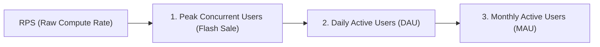

# 📘 Systems Engineering & SRE Study Guide: Converting RPS to Real-World User Scale

This study guide explains how to convert backend system throughput (**RPS - Requests Per Second**) into real-world business metrics (**Peak Concurrent Users**, **DAU - Daily Active Users**, and **MAU - Monthly Active Users**). 

Use this handbook for **System Design Interviews**, **SRE capacity planning**, and **Investor/CTO pitch presentations**.

---

## 🧭 Table of Contents
1. [Core Concept & Simple Analogy](#1-core-concept--simple-analogy)
2. [The 3 Core Mathematical Formulas](#2-the-3-core-mathematical-formulas)
3. [Step-by-Step Worked Calculation Example](#3-step-by-step-worked-calculation-example)
4. [The CTO & Founder Investor Pitch Guide](#4-the-cto--founder-investor-pitch-guide)
5. [Summary Reference Matrix](#5-summary-reference-matrix)
6. [Self-Test Practice Problems & Interview Flashcards](#6-self-test-practice-problems--interview-flashcards)

---

## 1. Core Concept & Simple Analogy

### What is RPS?
**RPS (Requests Per Second)** is the number of complete HTTP API requests (such as `GET /products`, `POST /orders`, or `POST /auth/login`) that your server infrastructure finishes processing in **one single second**.

### 🛒 The Supermarket Analogy:
* Imagine a supermarket checkout line with cashiers.
* **1 Request** = 1 customer getting their cart scanned, paid for, and handed a receipt.
* **`4,665.84 RPS`** means your backend system is scanning receipts and packing groceries for **4,665 customers EVERY SINGLE SECOND** with zero errors and zero dropped carts!

---

## 2. The 3 Core Mathematical Formulas

### Formula 1: Peak Concurrent Active Users (Flash Sale Scale)
Real human users do not click a button every millisecond. A user spends time looking at product photos or reading text before clicking the next page (**Think Time $T$**, typically 5 to 10 seconds).

$$\text{Peak Concurrent Active Users} = \text{RPS} \times \text{Think Time (Seconds)}$$

---

### Formula 2: Daily Active Users (DAU)
How many unique users can use the platform in a 24-hour day?

$$\text{Total Daily Requests} = \text{RPS} \times 86,400 \text{ seconds/day}$$

$$\text{Daily Active Users (DAU)} = \frac{\text{Total Daily Requests}}{\text{Average Requests per User per Day}}$$

> 💡 *Note*: In consumer web & e-commerce applications, an average user makes **15 to 25 API calls** per daily session (login, search, view 10 products, view cart, checkout).

---

### Formula 3: Monthly Active Users (MAU)
In consumer web applications, Daily Active Users (DAU) is typically **15% to 20%** of total Monthly Active Users (MAU). Therefore:

$$\text{MAU} \approx \text{DAU} \times 5$$

---

## 3. Step-by-Step Worked Calculation Example

Using our live **Milestone V3 Hetzner Cloud Cluster Benchmark Results** (**4,665.84 RPS**):

### Step 1: Calculate Peak Concurrent Users
* **At $T = 5\text{s}$ think time**:
  $$4,665.84 \times 5 = \mathbf{23,329.2 \text{ Simultaneous Active Users}}$$
* **At $T = 10\text{s}$ think time**:
  $$4,665.84 \times 10 = \mathbf{46,658.4 \text{ Simultaneous Active Users}}$$

---

### Step 2: Calculate Daily Active Users (DAU)
1. **Total Daily Capacity**:
   $$4,665.84 \text{ req/sec} \times 86,400 \text{ seconds/day} = \mathbf{403,128,576 \text{ requests/day}}$$

2. **DAU Capacity** (assuming 20 API requests/user/day):
   $$\text{DAU} = \frac{403,128,576}{20} = \mathbf{20,156,428 \text{ Daily Active Users (20.15M DAU)}}$$

---

### Step 3: Calculate Monthly Active Users (MAU)
$$\text{MAU} = 20,156,428 \times 5 = \mathbf{100,782,140 \text{ Monthly Active Users (100.78M MAU)}}$$

---

## 4. The CTO & Founder Investor Pitch Guide

When an investor or non-technical stakeholder asks: **"How many users can your system handle?"**, use this structured CTO response:

### 🗣️ The Investor Pitch Response Script:

> *"On our baseline €20/month cloud infrastructure (4 small Hetzner VMs), our Rust backend processes **4,665 requests per second** with **100% zero-error reliability** and **215ms median latency**.
>
> In business metrics, this capacity supports:
> 1. **Peak Flash Sale Traffic**: **23,000 to 46,000 users browsing simultaneously** during peak traffic.
> 2. **Daily Active Scale**: Over **400 Million requests per day**, supporting **20 Million Daily Active Users (DAU)**.
> 3. **Total Platform Scale**: Over **100 Million Monthly Active Users (MAU)**.
>
> Because our Axum micro-cluster architecture is horizontally scalable, scaling to **10,000+ RPS** simply requires deploying additional worker instances with zero code changes."*

---

## 5. Summary Reference Matrix

| Metric | Empirical Result | Business User Equivalent | Formula Used |
| :--- | :--- | :--- | :--- |
| **Raw Throughput** | `4,665.84 RPS` | **403,128,576 Requests / Day** | $\text{RPS} \times 86,400\text{s}$ |
| **Flash Sale Peak** | 3,000 VUs (0% error) | **23,000 - 46,000 Concurrent Users** | $\text{RPS} \times \text{Think Time (5-10s)}$ |
| **Daily Active Scale** | 20 req/user/day | **20.15 Million DAU** | $\frac{\text{Daily Requests}}{20}$ |
| **Monthly Active Base** | DAU x 5 ratio | **100.78 Million MAU** | $\text{DAU} \times 5$ |
| **Hardware Infrastructure** | 4 x Hetzner `cx23` | **€20.48 / month (~$22.50 / month)** | Live Cloud Benchmark |

---

## 6. Self-Test Practice Problems & Interview Flashcards

### ✏️ Practice Problem 1:
> **Question**: *Your API handles 1,000 RPS. Assuming an average user makes 10 requests per day, what is your DAU capacity?*
>
> **Solution**:
> 1. $\text{Daily Requests} = 1,000 \times 86,400 = 86,400,000 \text{ requests/day}$.
> 2. $\text{DAU} = \frac{86,400,000}{10} = \mathbf{8.64 \text{ Million DAU}}$.

---

### 🃏 Flashcard 1: System Design Interview
> **Question**: *How do you estimate required RPS for an app targeting 10 Million Daily Active Users?*
>
> **Answer**:
> "If 10M users make an average of 20 requests per day, total daily volume is $200\text{M requests/day}$. Dividing by 86,400 seconds gives an average rate of $\approx 2,315 \text{ RPS}$. Applying a peak-to-average factor of $2\times$ or $3\times$ for peak hours, the backend architecture must be provisioned to sustain $\approx \mathbf{4,630 \text{ to } 6,945 \text{ Peak RPS}}$."
