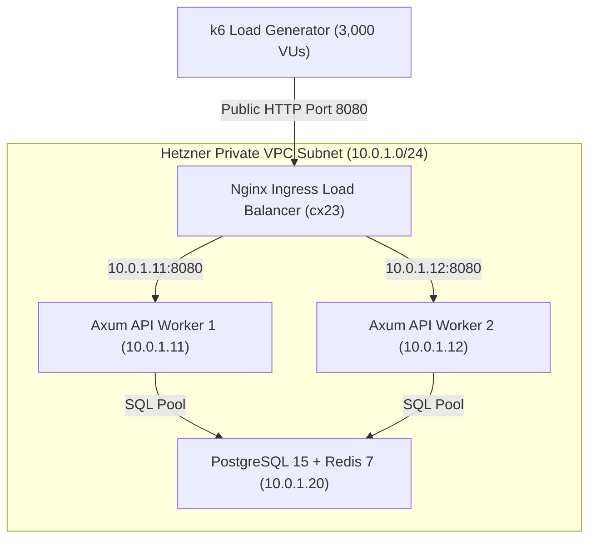

# Milestone V3 — Hetzner Cloud Multi-Node Cluster & SRE Benchmark Guide

This directory contains the production-grade SRE Terraform infrastructure, Packer HCL golden image builder, and Ansible automation for benchmarking the Rust Axum E-Commerce Lab on Hetzner Cloud.

---

## 🏗️ Infrastructure Architecture Diagram



### SRE Security & IP Quota Optimization
* **1 Public Ingress IPv4**: Only `ecommerce-nginx-lb` receives a public IPv4 address (`public_net { ipv4_enabled = true }`).
* **Isolated Backend Nodes**: Database node (`10.0.1.20`) and API workers (`10.0.1.11`, `10.0.1.12`) operate with `public_net { ipv4_enabled = false }`, completely isolated inside the private VPC (`10.0.1.0/24`). This bypasses Hetzner Primary IP quota limits while securing internal database traffic.
* **Inline Declarative Networks**: Private VPC networks are declared inline inside `hcloud_server` blocks (`network { network_id = ... ip = "10.0.1.x" }`), ensuring NICs are attached by the hypervisor *before* VM power-on (zero boot race conditions).

---

## 🚀 How to Run the Automated Benchmark

To run the complete automated lifecycle (Packer Golden Image lookup -> Terraform spawn -> 3,000 VU k6 load test -> Automated Teardown):

```bash
# 1. Ensure HCLOUD_TOKEN is set in your .env file
# 2. Execute the single-command benchmark runner
bash scripts/run_v3_hetzner_benchmark.sh
```

### Script Execution Stages
1. **Terraform Apply**: Provisions 4 x `cx23` VMs (2 vCPU, 4GB RAM) in Nuremberg (`nbg1`).
2. **Cloud-Init Auto-Start**: Pre-baked Packer image boots Postgres/Redis, Axum workers, and Nginx LB natively.
3. **Health Check**: Polls `http://<NGINX_PUBLIC_IP>:8080/health` until 200 OK.
4. **k6 Load Test**: Fires 3,000 VU load test against Nginx public IP.
5. **Teardown**: Automated `trap cleanup EXIT` destroys all Hetzner VMs upon finish (0 wasted money).

---

## 📸 How to Manage & Delete Packer Golden Snapshots

Packer pre-bakes Ubuntu 24.04, Docker, Postgres/Redis images, compiled Rust binaries, and Nginx configs into a Hetzner Snapshot (~€0.014/month storage cost).

### 1. Build & Upload a New Packer Golden Image Snapshot
```bash
# Compiles Rust release binary and bakes + uploads the snapshot to Hetzner Cloud
bash scripts/build_v3_packer_image.sh
```

### 2. List Existing Snapshots
Using `hcloud` CLI or curl API:

```bash
# Using Hetzner CLI
hcloud image list --type snapshot --selector project=rust-ecommerce-lab

# Using cURL API
HCLOUD_TOKEN=$(grep -E "^(HCLOUD_TOKEN|terraform_api_token)=" .env | cut -d '=' -f2- | tr -d ' "' | head -n 1)
curl -s -H "Authorization: Bearer $HCLOUD_TOKEN" "https://api.hetzner.cloud/v1/images?type=snapshot"
```

### 3. Delete / Remove Snapshots (Teardown Storage Cost: €0.00)
To delete all custom Packer snapshots and stop recurring storage charges:

```bash
# Single-command automated snapshot removal
bash scripts/delete_v3_packer_snapshots.sh
```

